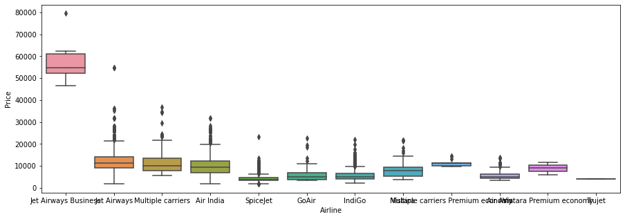
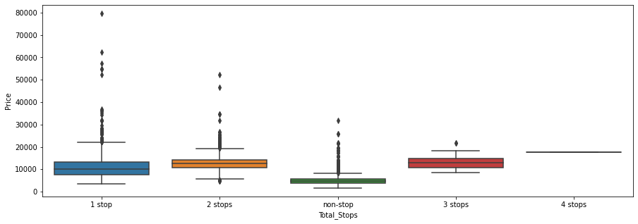
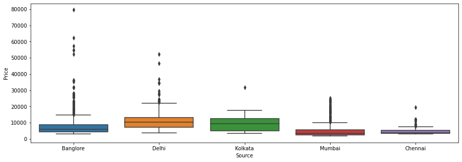
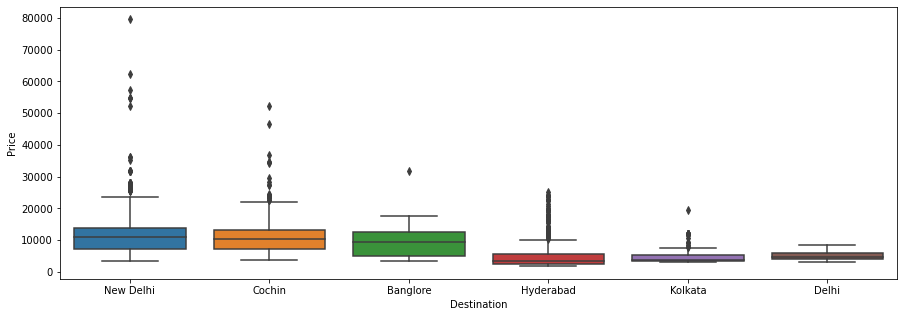

## Data & Data-preprocessing 


```python
import pandas as pd
import numpy as np
import seaborn as sns
import matplotlib.pyplot as plt
```


```python
train_data = pd.read_excel('Data_Train.xlsx')
```


```python
train_data.head()
```


<div>
<style scoped>
    .dataframe tbody tr th:only-of-type {
        vertical-align: middle;
    }

    .dataframe tbody tr th {
        vertical-align: top;
    }

    .dataframe thead th {
        text-align: right;
    }
</style>
<table border="1" class="dataframe">
  <thead>
    <tr style="text-align: right;">
      <th></th>
      <th>Airline</th>
      <th>Date_of_Journey</th>
      <th>Source</th>
      <th>Destination</th>
      <th>Route</th>
      <th>Dep_Time</th>
      <th>Arrival_Time</th>
      <th>Duration</th>
      <th>Total_Stops</th>
      <th>Additional_Info</th>
      <th>Price</th>
    </tr>
  </thead>
  <tbody>
    <tr>
      <th>0</th>
      <td>IndiGo</td>
      <td>24/03/2019</td>
      <td>Banglore</td>
      <td>New Delhi</td>
      <td>BLR → DEL</td>
      <td>22:20</td>
      <td>01:10 22 Mar</td>
      <td>2h 50m</td>
      <td>non-stop</td>
      <td>No info</td>
      <td>3897</td>
    </tr>
    <tr>
      <th>1</th>
      <td>Air India</td>
      <td>1/05/2019</td>
      <td>Kolkata</td>
      <td>Banglore</td>
      <td>CCU → IXR → BBI → BLR</td>
      <td>05:50</td>
      <td>13:15</td>
      <td>7h 25m</td>
      <td>2 stops</td>
      <td>No info</td>
      <td>7662</td>
    </tr>
    <tr>
      <th>2</th>
      <td>Jet Airways</td>
      <td>9/06/2019</td>
      <td>Delhi</td>
      <td>Cochin</td>
      <td>DEL → LKO → BOM → COK</td>
      <td>09:25</td>
      <td>04:25 10 Jun</td>
      <td>19h</td>
      <td>2 stops</td>
      <td>No info</td>
      <td>13882</td>
    </tr>
    <tr>
      <th>3</th>
      <td>IndiGo</td>
      <td>12/05/2019</td>
      <td>Kolkata</td>
      <td>Banglore</td>
      <td>CCU → NAG → BLR</td>
      <td>18:05</td>
      <td>23:30</td>
      <td>5h 25m</td>
      <td>1 stop</td>
      <td>No info</td>
      <td>6218</td>
    </tr>
    <tr>
      <th>4</th>
      <td>IndiGo</td>
      <td>01/03/2019</td>
      <td>Banglore</td>
      <td>New Delhi</td>
      <td>BLR → NAG → DEL</td>
      <td>16:50</td>
      <td>21:35</td>
      <td>4h 45m</td>
      <td>1 stop</td>
      <td>No info</td>
      <td>13302</td>
    </tr>
  </tbody>
</table>
</div>


```python
#missing values
train_data.isna().sum()
```


    Airline            0
    Date_of_Journey    0
    Source             0
    Destination        0
    Route              1
    Dep_Time           0
    Arrival_Time       0
    Duration           0
    Total_Stops        1
    Additional_Info    0
    Price              0
    dtype: int64


```python
# rows & cols
train_data.shape
```


    (10683, 11)


```python
# remove missing values
train_data.dropna(inplace=True)
train_data.isna().sum()
```


    Airline            0
    Date_of_Journey    0
    Source             0
    Destination        0
    Route              0
    Dep_Time           0
    Arrival_Time       0
    Duration           0
    Total_Stops        0
    Additional_Info    0
    Price              0
    dtype: int64


```python
# data type
train_data.dtypes
```


    Airline            object
    Date_of_Journey    object
    Source             object
    Destination        object
    Route              object
    Dep_Time           object
    Arrival_Time       object
    Duration           object
    Total_Stops        object
    Additional_Info    object
    Price               int64
    dtype: object


```python
# Dep_Time, Arrival_Time & Date_of_Journey need to convert into datetime format
def change_into_datetime(col):
    train_data[col]=pd.to_datetime(train_data[col])
```


```python
train_data.columns
```


    Index(['Airline', 'Date_of_Journey', 'Source', 'Destination', 'Route',
           'Dep_Time', 'Arrival_Time', 'Duration', 'Total_Stops',
           'Additional_Info', 'Price'],
          dtype='object')


```python
for i in['Date_of_Journey', 'Dep_Time', 'Arrival_Time']:
    change_into_datetime(i)
```


```python
# data type
train_data.dtypes
```


    Airline                    object
    Date_of_Journey    datetime64[ns]
    Source                     object
    Destination                object
    Route                      object
    Dep_Time           datetime64[ns]
    Arrival_Time       datetime64[ns]
    Duration                   object
    Total_Stops                object
    Additional_Info            object
    Price                       int64
    dtype: object


```python
## creating new col for day & month to understand by ml model
train_data['journey_day'] = train_data['Date_of_Journey'].dt.day
train_data['journey_mobth'] = train_data['Dep_Time'].dt.month
```


```python
train_data.head()
```


<div>
<style scoped>
    .dataframe tbody tr th:only-of-type {
        vertical-align: middle;
    }

    .dataframe tbody tr th {
        vertical-align: top;
    }

    .dataframe thead th {
        text-align: right;
    }
</style>
<table border="1" class="dataframe">
  <thead>
    <tr style="text-align: right;">
      <th></th>
      <th>Airline</th>
      <th>Date_of_Journey</th>
      <th>Source</th>
      <th>Destination</th>
      <th>Route</th>
      <th>Dep_Time</th>
      <th>Arrival_Time</th>
      <th>Duration</th>
      <th>Total_Stops</th>
      <th>Additional_Info</th>
      <th>Price</th>
      <th>journey_day</th>
      <th>journey_mobth</th>
    </tr>
  </thead>
  <tbody>
    <tr>
      <th>0</th>
      <td>IndiGo</td>
      <td>2019-03-24</td>
      <td>Banglore</td>
      <td>New Delhi</td>
      <td>BLR → DEL</td>
      <td>2021-03-10 22:20:00</td>
      <td>2021-03-22 01:10:00</td>
      <td>2h 50m</td>
      <td>non-stop</td>
      <td>No info</td>
      <td>3897</td>
      <td>24</td>
      <td>3</td>
    </tr>
    <tr>
      <th>1</th>
      <td>Air India</td>
      <td>2019-01-05</td>
      <td>Kolkata</td>
      <td>Banglore</td>
      <td>CCU → IXR → BBI → BLR</td>
      <td>2021-03-10 05:50:00</td>
      <td>2021-03-10 13:15:00</td>
      <td>7h 25m</td>
      <td>2 stops</td>
      <td>No info</td>
      <td>7662</td>
      <td>5</td>
      <td>3</td>
    </tr>
    <tr>
      <th>2</th>
      <td>Jet Airways</td>
      <td>2019-09-06</td>
      <td>Delhi</td>
      <td>Cochin</td>
      <td>DEL → LKO → BOM → COK</td>
      <td>2021-03-10 09:25:00</td>
      <td>2021-06-10 04:25:00</td>
      <td>19h</td>
      <td>2 stops</td>
      <td>No info</td>
      <td>13882</td>
      <td>6</td>
      <td>3</td>
    </tr>
    <tr>
      <th>3</th>
      <td>IndiGo</td>
      <td>2019-12-05</td>
      <td>Kolkata</td>
      <td>Banglore</td>
      <td>CCU → NAG → BLR</td>
      <td>2021-03-10 18:05:00</td>
      <td>2021-03-10 23:30:00</td>
      <td>5h 25m</td>
      <td>1 stop</td>
      <td>No info</td>
      <td>6218</td>
      <td>5</td>
      <td>3</td>
    </tr>
    <tr>
      <th>4</th>
      <td>IndiGo</td>
      <td>2019-01-03</td>
      <td>Banglore</td>
      <td>New Delhi</td>
      <td>BLR → NAG → DEL</td>
      <td>2021-03-10 16:50:00</td>
      <td>2021-03-10 21:35:00</td>
      <td>4h 45m</td>
      <td>1 stop</td>
      <td>No info</td>
      <td>13302</td>
      <td>3</td>
      <td>3</td>
    </tr>
  </tbody>
</table>
</div>


```python
# removing Date_of_Journey 
train_data.drop('Date_of_Journey', axis=1, inplace=True)
```


```python

```

## Extract Derived Features from Data


```python
# Extrack Hour
def extrack_hour(df, col):
    df[col+'_hour'] = df[col].dt.hour
# Extrack Minute
def extrack_min(df,col):
    df[col+'_minute']= df[col].dt.minute
#Drop/remove Column
def drop_column(df, col):
    df.drop(col, axis=1, inplace=True)
    
```


```python
extrack_hour(train_data, 'Dep_Time')
extrack_min(train_data, 'Dep_Time')
drop_column(train_data, 'Dep_Time')
```


```python
train_data.head()
```


<div>
<style scoped>
    .dataframe tbody tr th:only-of-type {
        vertical-align: middle;
    }

    .dataframe tbody tr th {
        vertical-align: top;
    }

    .dataframe thead th {
        text-align: right;
    }
</style>
<table border="1" class="dataframe">
  <thead>
    <tr style="text-align: right;">
      <th></th>
      <th>Airline</th>
      <th>Source</th>
      <th>Destination</th>
      <th>Route</th>
      <th>Arrival_Time</th>
      <th>Duration</th>
      <th>Total_Stops</th>
      <th>Additional_Info</th>
      <th>Price</th>
      <th>journey_day</th>
      <th>journey_mobth</th>
      <th>Dep_Time_hour</th>
      <th>Dep_Time_minute</th>
    </tr>
  </thead>
  <tbody>
    <tr>
      <th>0</th>
      <td>IndiGo</td>
      <td>Banglore</td>
      <td>New Delhi</td>
      <td>BLR → DEL</td>
      <td>2021-03-22 01:10:00</td>
      <td>2h 50m</td>
      <td>non-stop</td>
      <td>No info</td>
      <td>3897</td>
      <td>24</td>
      <td>3</td>
      <td>22</td>
      <td>20</td>
    </tr>
    <tr>
      <th>1</th>
      <td>Air India</td>
      <td>Kolkata</td>
      <td>Banglore</td>
      <td>CCU → IXR → BBI → BLR</td>
      <td>2021-03-10 13:15:00</td>
      <td>7h 25m</td>
      <td>2 stops</td>
      <td>No info</td>
      <td>7662</td>
      <td>5</td>
      <td>3</td>
      <td>5</td>
      <td>50</td>
    </tr>
    <tr>
      <th>2</th>
      <td>Jet Airways</td>
      <td>Delhi</td>
      <td>Cochin</td>
      <td>DEL → LKO → BOM → COK</td>
      <td>2021-06-10 04:25:00</td>
      <td>19h</td>
      <td>2 stops</td>
      <td>No info</td>
      <td>13882</td>
      <td>6</td>
      <td>3</td>
      <td>9</td>
      <td>25</td>
    </tr>
    <tr>
      <th>3</th>
      <td>IndiGo</td>
      <td>Kolkata</td>
      <td>Banglore</td>
      <td>CCU → NAG → BLR</td>
      <td>2021-03-10 23:30:00</td>
      <td>5h 25m</td>
      <td>1 stop</td>
      <td>No info</td>
      <td>6218</td>
      <td>5</td>
      <td>3</td>
      <td>18</td>
      <td>5</td>
    </tr>
    <tr>
      <th>4</th>
      <td>IndiGo</td>
      <td>Banglore</td>
      <td>New Delhi</td>
      <td>BLR → NAG → DEL</td>
      <td>2021-03-10 21:35:00</td>
      <td>4h 45m</td>
      <td>1 stop</td>
      <td>No info</td>
      <td>13302</td>
      <td>3</td>
      <td>3</td>
      <td>16</td>
      <td>50</td>
    </tr>
  </tbody>
</table>
</div>


```python
extrack_hour(train_data, 'Arrival_Time')
extrack_min(train_data, 'Arrival_Time')
drop_column(train_data, 'Arrival_Time')
```


```python
train_data.head()
```


<div>
<style scoped>
    .dataframe tbody tr th:only-of-type {
        vertical-align: middle;
    }

    .dataframe tbody tr th {
        vertical-align: top;
    }

    .dataframe thead th {
        text-align: right;
    }
</style>
<table border="1" class="dataframe">
  <thead>
    <tr style="text-align: right;">
      <th></th>
      <th>Airline</th>
      <th>Source</th>
      <th>Destination</th>
      <th>Route</th>
      <th>Duration</th>
      <th>Total_Stops</th>
      <th>Additional_Info</th>
      <th>Price</th>
      <th>journey_day</th>
      <th>journey_mobth</th>
      <th>Dep_Time_hour</th>
      <th>Dep_Time_minute</th>
      <th>Arrival_Time_hour</th>
      <th>Arrival_Time_minute</th>
    </tr>
  </thead>
  <tbody>
    <tr>
      <th>0</th>
      <td>IndiGo</td>
      <td>Banglore</td>
      <td>New Delhi</td>
      <td>BLR → DEL</td>
      <td>2h 50m</td>
      <td>non-stop</td>
      <td>No info</td>
      <td>3897</td>
      <td>24</td>
      <td>3</td>
      <td>22</td>
      <td>20</td>
      <td>1</td>
      <td>10</td>
    </tr>
    <tr>
      <th>1</th>
      <td>Air India</td>
      <td>Kolkata</td>
      <td>Banglore</td>
      <td>CCU → IXR → BBI → BLR</td>
      <td>7h 25m</td>
      <td>2 stops</td>
      <td>No info</td>
      <td>7662</td>
      <td>5</td>
      <td>3</td>
      <td>5</td>
      <td>50</td>
      <td>13</td>
      <td>15</td>
    </tr>
    <tr>
      <th>2</th>
      <td>Jet Airways</td>
      <td>Delhi</td>
      <td>Cochin</td>
      <td>DEL → LKO → BOM → COK</td>
      <td>19h</td>
      <td>2 stops</td>
      <td>No info</td>
      <td>13882</td>
      <td>6</td>
      <td>3</td>
      <td>9</td>
      <td>25</td>
      <td>4</td>
      <td>25</td>
    </tr>
    <tr>
      <th>3</th>
      <td>IndiGo</td>
      <td>Kolkata</td>
      <td>Banglore</td>
      <td>CCU → NAG → BLR</td>
      <td>5h 25m</td>
      <td>1 stop</td>
      <td>No info</td>
      <td>6218</td>
      <td>5</td>
      <td>3</td>
      <td>18</td>
      <td>5</td>
      <td>23</td>
      <td>30</td>
    </tr>
    <tr>
      <th>4</th>
      <td>IndiGo</td>
      <td>Banglore</td>
      <td>New Delhi</td>
      <td>BLR → NAG → DEL</td>
      <td>4h 45m</td>
      <td>1 stop</td>
      <td>No info</td>
      <td>13302</td>
      <td>3</td>
      <td>3</td>
      <td>16</td>
      <td>50</td>
      <td>21</td>
      <td>35</td>
    </tr>
  </tbody>
</table>
</div>


```python
# logic
'3h 7m'.split(' ')
```


    ['3h', '7m']


```python
duration = list(train_data['Duration'])
for i in range(len(duration)):
    if len(duration[i].split(' '))==2:
        pass
    else:
        if 'h' in duration[i]:
            duration[i] = duration[i] + ' 0m'
        else:
            duration[i] = '0h' + duration[i]


    
```


```python

```


```python
train_data['Duration'] = duration
```


```python
train_data.head()
```


<div>
<style scoped>
    .dataframe tbody tr th:only-of-type {
        vertical-align: middle;
    }

    .dataframe tbody tr th {
        vertical-align: top;
    }

    .dataframe thead th {
        text-align: right;
    }
</style>
<table border="1" class="dataframe">
  <thead>
    <tr style="text-align: right;">
      <th></th>
      <th>Airline</th>
      <th>Source</th>
      <th>Destination</th>
      <th>Route</th>
      <th>Duration</th>
      <th>Total_Stops</th>
      <th>Additional_Info</th>
      <th>Price</th>
      <th>journey_day</th>
      <th>journey_mobth</th>
      <th>Dep_Time_hour</th>
      <th>Dep_Time_minute</th>
      <th>Arrival_Time_hour</th>
      <th>Arrival_Time_minute</th>
    </tr>
  </thead>
  <tbody>
    <tr>
      <th>0</th>
      <td>IndiGo</td>
      <td>Banglore</td>
      <td>New Delhi</td>
      <td>BLR → DEL</td>
      <td>2h 50m</td>
      <td>non-stop</td>
      <td>No info</td>
      <td>3897</td>
      <td>24</td>
      <td>3</td>
      <td>22</td>
      <td>20</td>
      <td>1</td>
      <td>10</td>
    </tr>
    <tr>
      <th>1</th>
      <td>Air India</td>
      <td>Kolkata</td>
      <td>Banglore</td>
      <td>CCU → IXR → BBI → BLR</td>
      <td>7h 25m</td>
      <td>2 stops</td>
      <td>No info</td>
      <td>7662</td>
      <td>5</td>
      <td>3</td>
      <td>5</td>
      <td>50</td>
      <td>13</td>
      <td>15</td>
    </tr>
    <tr>
      <th>2</th>
      <td>Jet Airways</td>
      <td>Delhi</td>
      <td>Cochin</td>
      <td>DEL → LKO → BOM → COK</td>
      <td>19h 0m</td>
      <td>2 stops</td>
      <td>No info</td>
      <td>13882</td>
      <td>6</td>
      <td>3</td>
      <td>9</td>
      <td>25</td>
      <td>4</td>
      <td>25</td>
    </tr>
    <tr>
      <th>3</th>
      <td>IndiGo</td>
      <td>Kolkata</td>
      <td>Banglore</td>
      <td>CCU → NAG → BLR</td>
      <td>5h 25m</td>
      <td>1 stop</td>
      <td>No info</td>
      <td>6218</td>
      <td>5</td>
      <td>3</td>
      <td>18</td>
      <td>5</td>
      <td>23</td>
      <td>30</td>
    </tr>
    <tr>
      <th>4</th>
      <td>IndiGo</td>
      <td>Banglore</td>
      <td>New Delhi</td>
      <td>BLR → NAG → DEL</td>
      <td>4h 45m</td>
      <td>1 stop</td>
      <td>No info</td>
      <td>13302</td>
      <td>3</td>
      <td>3</td>
      <td>16</td>
      <td>50</td>
      <td>21</td>
      <td>35</td>
    </tr>
  </tbody>
</table>
</div>


```python
## Extrack Hour
def hour(x):
    return x.split(' ')[0][0:-1]

## Extrack Minute
def minute(x):
    return x.split(' ')[1][0:-1]
```


```python
train_data['Duration_hours'] = train_data['Duration'].apply(hour)
train_data['Duration_mins'] = train_data['Duration'].apply(minute)
```


```python
train_data.head()
```


<div>
<style scoped>
    .dataframe tbody tr th:only-of-type {
        vertical-align: middle;
    }

    .dataframe tbody tr th {
        vertical-align: top;
    }

    .dataframe thead th {
        text-align: right;
    }
</style>
<table border="1" class="dataframe">
  <thead>
    <tr style="text-align: right;">
      <th></th>
      <th>Airline</th>
      <th>Source</th>
      <th>Destination</th>
      <th>Route</th>
      <th>Duration</th>
      <th>Total_Stops</th>
      <th>Additional_Info</th>
      <th>Price</th>
      <th>journey_day</th>
      <th>journey_mobth</th>
      <th>Dep_Time_hour</th>
      <th>Dep_Time_minute</th>
      <th>Arrival_Time_hour</th>
      <th>Arrival_Time_minute</th>
      <th>Duration_hours</th>
      <th>Duration_mins</th>
    </tr>
  </thead>
  <tbody>
    <tr>
      <th>0</th>
      <td>IndiGo</td>
      <td>Banglore</td>
      <td>New Delhi</td>
      <td>BLR → DEL</td>
      <td>2h 50m</td>
      <td>non-stop</td>
      <td>No info</td>
      <td>3897</td>
      <td>24</td>
      <td>3</td>
      <td>22</td>
      <td>20</td>
      <td>1</td>
      <td>10</td>
      <td>2</td>
      <td>50</td>
    </tr>
    <tr>
      <th>1</th>
      <td>Air India</td>
      <td>Kolkata</td>
      <td>Banglore</td>
      <td>CCU → IXR → BBI → BLR</td>
      <td>7h 25m</td>
      <td>2 stops</td>
      <td>No info</td>
      <td>7662</td>
      <td>5</td>
      <td>3</td>
      <td>5</td>
      <td>50</td>
      <td>13</td>
      <td>15</td>
      <td>7</td>
      <td>25</td>
    </tr>
    <tr>
      <th>2</th>
      <td>Jet Airways</td>
      <td>Delhi</td>
      <td>Cochin</td>
      <td>DEL → LKO → BOM → COK</td>
      <td>19h 0m</td>
      <td>2 stops</td>
      <td>No info</td>
      <td>13882</td>
      <td>6</td>
      <td>3</td>
      <td>9</td>
      <td>25</td>
      <td>4</td>
      <td>25</td>
      <td>19</td>
      <td>0</td>
    </tr>
    <tr>
      <th>3</th>
      <td>IndiGo</td>
      <td>Kolkata</td>
      <td>Banglore</td>
      <td>CCU → NAG → BLR</td>
      <td>5h 25m</td>
      <td>1 stop</td>
      <td>No info</td>
      <td>6218</td>
      <td>5</td>
      <td>3</td>
      <td>18</td>
      <td>5</td>
      <td>23</td>
      <td>30</td>
      <td>5</td>
      <td>25</td>
    </tr>
    <tr>
      <th>4</th>
      <td>IndiGo</td>
      <td>Banglore</td>
      <td>New Delhi</td>
      <td>BLR → NAG → DEL</td>
      <td>4h 45m</td>
      <td>1 stop</td>
      <td>No info</td>
      <td>13302</td>
      <td>3</td>
      <td>3</td>
      <td>16</td>
      <td>50</td>
      <td>21</td>
      <td>35</td>
      <td>4</td>
      <td>45</td>
    </tr>
  </tbody>
</table>
</div>


```python
# Remove Duration
drop_column(train_data, 'Duration')
```


```python
train_data.dtypes
```


    Airline                object
    Source                 object
    Destination            object
    Route                  object
    Total_Stops            object
    Additional_Info        object
    Price                   int64
    journey_day             int64
    journey_mobth           int64
    Dep_Time_hour           int64
    Dep_Time_minute         int64
    Arrival_Time_hour       int64
    Arrival_Time_minute     int64
    Duration_hours         object
    Duration_mins          object
    dtype: object


```python
train_data['Duration_hours'] = train_data['Duration_hours'].astype(int)
train_data['Duration_mins'] = train_data['Duration_mins'].astype(int)
```


```python
# Converted data type to num(int)
train_data.dtypes
```


    Airline                object
    Source                 object
    Destination            object
    Route                  object
    Total_Stops            object
    Additional_Info        object
    Price                   int64
    journey_day             int64
    journey_mobth           int64
    Dep_Time_hour           int64
    Dep_Time_minute         int64
    Arrival_Time_hour       int64
    Arrival_Time_minute     int64
    Duration_hours          int64
    Duration_mins           int64
    dtype: object


```python
#categorical data
cat_col = [col for col in train_data.columns if train_data[col].dtype=='O']
cat_col 
```


    ['Airline', 'Source', 'Destination', 'Route', 'Total_Stops', 'Additional_Info']


```python
# Not categorical data
cont_col = [col for col in train_data.columns if train_data[col].dtype!='O']
cont_col 
```


    ['Price',
     'journey_day',
     'journey_mobth',
     'Dep_Time_hour',
     'Dep_Time_minute',
     'Arrival_Time_hour',
     'Arrival_Time_minute',
     'Duration_hours',
     'Duration_mins']


```python

```

## Handle Categorical Data & Feature Encoding


```python
categorical = train_data[cat_col]
```


```python
categorical.head()
```


<div>
<style scoped>
    .dataframe tbody tr th:only-of-type {
        vertical-align: middle;
    }

    .dataframe tbody tr th {
        vertical-align: top;
    }

    .dataframe thead th {
        text-align: right;
    }
</style>
<table border="1" class="dataframe">
  <thead>
    <tr style="text-align: right;">
      <th></th>
      <th>Airline</th>
      <th>Source</th>
      <th>Destination</th>
      <th>Route</th>
      <th>Total_Stops</th>
      <th>Additional_Info</th>
    </tr>
  </thead>
  <tbody>
    <tr>
      <th>0</th>
      <td>IndiGo</td>
      <td>Banglore</td>
      <td>New Delhi</td>
      <td>BLR → DEL</td>
      <td>non-stop</td>
      <td>No info</td>
    </tr>
    <tr>
      <th>1</th>
      <td>Air India</td>
      <td>Kolkata</td>
      <td>Banglore</td>
      <td>CCU → IXR → BBI → BLR</td>
      <td>2 stops</td>
      <td>No info</td>
    </tr>
    <tr>
      <th>2</th>
      <td>Jet Airways</td>
      <td>Delhi</td>
      <td>Cochin</td>
      <td>DEL → LKO → BOM → COK</td>
      <td>2 stops</td>
      <td>No info</td>
    </tr>
    <tr>
      <th>3</th>
      <td>IndiGo</td>
      <td>Kolkata</td>
      <td>Banglore</td>
      <td>CCU → NAG → BLR</td>
      <td>1 stop</td>
      <td>No info</td>
    </tr>
    <tr>
      <th>4</th>
      <td>IndiGo</td>
      <td>Banglore</td>
      <td>New Delhi</td>
      <td>BLR → NAG → DEL</td>
      <td>1 stop</td>
      <td>No info</td>
    </tr>
  </tbody>
</table>
</div>


```python
categorical['Airline'].value_counts()
```


    Jet Airways                          3849
    IndiGo                               2053
    Air India                            1751
    Multiple carriers                    1196
    SpiceJet                              818
    Vistara                               479
    Air Asia                              319
    GoAir                                 194
    Multiple carriers Premium economy      13
    Jet Airways Business                    6
    Vistara Premium economy                 3
    Trujet                                  1
    Name: Airline, dtype: int64


```python

```


```python
# plot
plt.figure(figsize=(15, 5))
sns.boxplot(x='Airline', y='Price', data=train_data.sort_values('Price', ascending=False))
```


    <AxesSubplot:xlabel='Airline', ylabel='Price'>


    

    


```python
train_data.head()
```


<div>
<style scoped>
    .dataframe tbody tr th:only-of-type {
        vertical-align: middle;
    }

    .dataframe tbody tr th {
        vertical-align: top;
    }

    .dataframe thead th {
        text-align: right;
    }
</style>
<table border="1" class="dataframe">
  <thead>
    <tr style="text-align: right;">
      <th></th>
      <th>Airline</th>
      <th>Source</th>
      <th>Destination</th>
      <th>Route</th>
      <th>Total_Stops</th>
      <th>Additional_Info</th>
      <th>Price</th>
      <th>journey_day</th>
      <th>journey_mobth</th>
      <th>Dep_Time_hour</th>
      <th>Dep_Time_minute</th>
      <th>Arrival_Time_hour</th>
      <th>Arrival_Time_minute</th>
      <th>Duration_hours</th>
      <th>Duration_mins</th>
    </tr>
  </thead>
  <tbody>
    <tr>
      <th>0</th>
      <td>IndiGo</td>
      <td>Banglore</td>
      <td>New Delhi</td>
      <td>BLR → DEL</td>
      <td>non-stop</td>
      <td>No info</td>
      <td>3897</td>
      <td>24</td>
      <td>3</td>
      <td>22</td>
      <td>20</td>
      <td>1</td>
      <td>10</td>
      <td>2</td>
      <td>50</td>
    </tr>
    <tr>
      <th>1</th>
      <td>Air India</td>
      <td>Kolkata</td>
      <td>Banglore</td>
      <td>CCU → IXR → BBI → BLR</td>
      <td>2 stops</td>
      <td>No info</td>
      <td>7662</td>
      <td>5</td>
      <td>3</td>
      <td>5</td>
      <td>50</td>
      <td>13</td>
      <td>15</td>
      <td>7</td>
      <td>25</td>
    </tr>
    <tr>
      <th>2</th>
      <td>Jet Airways</td>
      <td>Delhi</td>
      <td>Cochin</td>
      <td>DEL → LKO → BOM → COK</td>
      <td>2 stops</td>
      <td>No info</td>
      <td>13882</td>
      <td>6</td>
      <td>3</td>
      <td>9</td>
      <td>25</td>
      <td>4</td>
      <td>25</td>
      <td>19</td>
      <td>0</td>
    </tr>
    <tr>
      <th>3</th>
      <td>IndiGo</td>
      <td>Kolkata</td>
      <td>Banglore</td>
      <td>CCU → NAG → BLR</td>
      <td>1 stop</td>
      <td>No info</td>
      <td>6218</td>
      <td>5</td>
      <td>3</td>
      <td>18</td>
      <td>5</td>
      <td>23</td>
      <td>30</td>
      <td>5</td>
      <td>25</td>
    </tr>
    <tr>
      <th>4</th>
      <td>IndiGo</td>
      <td>Banglore</td>
      <td>New Delhi</td>
      <td>BLR → NAG → DEL</td>
      <td>1 stop</td>
      <td>No info</td>
      <td>13302</td>
      <td>3</td>
      <td>3</td>
      <td>16</td>
      <td>50</td>
      <td>21</td>
      <td>35</td>
      <td>4</td>
      <td>45</td>
    </tr>
  </tbody>
</table>
</div>


```python
# Less stops high price
plt.figure(figsize=(15, 5))
sns.boxplot(x='Total_Stops', y='Price', data=train_data.sort_values('Price', ascending=False))
```


    <AxesSubplot:xlabel='Total_Stops', ylabel='Price'>


    

    


```python

```


```python
Airline = pd.get_dummies(categorical['Airline'], drop_first=True)
```


```python
Airline.head()
```


<div>
<style scoped>
    .dataframe tbody tr th:only-of-type {
        vertical-align: middle;
    }

    .dataframe tbody tr th {
        vertical-align: top;
    }

    .dataframe thead th {
        text-align: right;
    }
</style>
<table border="1" class="dataframe">
  <thead>
    <tr style="text-align: right;">
      <th></th>
      <th>Air India</th>
      <th>GoAir</th>
      <th>IndiGo</th>
      <th>Jet Airways</th>
      <th>Jet Airways Business</th>
      <th>Multiple carriers</th>
      <th>Multiple carriers Premium economy</th>
      <th>SpiceJet</th>
      <th>Trujet</th>
      <th>Vistara</th>
      <th>Vistara Premium economy</th>
    </tr>
  </thead>
  <tbody>
    <tr>
      <th>0</th>
      <td>0</td>
      <td>0</td>
      <td>1</td>
      <td>0</td>
      <td>0</td>
      <td>0</td>
      <td>0</td>
      <td>0</td>
      <td>0</td>
      <td>0</td>
      <td>0</td>
    </tr>
    <tr>
      <th>1</th>
      <td>1</td>
      <td>0</td>
      <td>0</td>
      <td>0</td>
      <td>0</td>
      <td>0</td>
      <td>0</td>
      <td>0</td>
      <td>0</td>
      <td>0</td>
      <td>0</td>
    </tr>
    <tr>
      <th>2</th>
      <td>0</td>
      <td>0</td>
      <td>0</td>
      <td>1</td>
      <td>0</td>
      <td>0</td>
      <td>0</td>
      <td>0</td>
      <td>0</td>
      <td>0</td>
      <td>0</td>
    </tr>
    <tr>
      <th>3</th>
      <td>0</td>
      <td>0</td>
      <td>1</td>
      <td>0</td>
      <td>0</td>
      <td>0</td>
      <td>0</td>
      <td>0</td>
      <td>0</td>
      <td>0</td>
      <td>0</td>
    </tr>
    <tr>
      <th>4</th>
      <td>0</td>
      <td>0</td>
      <td>1</td>
      <td>0</td>
      <td>0</td>
      <td>0</td>
      <td>0</td>
      <td>0</td>
      <td>0</td>
      <td>0</td>
      <td>0</td>
    </tr>
  </tbody>
</table>
</div>


```python
categorical['Source'].value_counts()
```


    Delhi       4536
    Kolkata     2871
    Banglore    2197
    Mumbai       697
    Chennai      381
    Name: Source, dtype: int64


```python

plt.figure(figsize=(15, 5))
sns.boxplot(x='Source', y='Price', data=train_data.sort_values('Price', ascending=False))
```


    <AxesSubplot:xlabel='Source', ylabel='Price'>


    

    


```python

```


```python
Source = pd.get_dummies(categorical['Source'], drop_first=True)
Source.head()
```


<div>
<style scoped>
    .dataframe tbody tr th:only-of-type {
        vertical-align: middle;
    }

    .dataframe tbody tr th {
        vertical-align: top;
    }

    .dataframe thead th {
        text-align: right;
    }
</style>
<table border="1" class="dataframe">
  <thead>
    <tr style="text-align: right;">
      <th></th>
      <th>Chennai</th>
      <th>Delhi</th>
      <th>Kolkata</th>
      <th>Mumbai</th>
    </tr>
  </thead>
  <tbody>
    <tr>
      <th>0</th>
      <td>0</td>
      <td>0</td>
      <td>0</td>
      <td>0</td>
    </tr>
    <tr>
      <th>1</th>
      <td>0</td>
      <td>0</td>
      <td>1</td>
      <td>0</td>
    </tr>
    <tr>
      <th>2</th>
      <td>0</td>
      <td>1</td>
      <td>0</td>
      <td>0</td>
    </tr>
    <tr>
      <th>3</th>
      <td>0</td>
      <td>0</td>
      <td>1</td>
      <td>0</td>
    </tr>
    <tr>
      <th>4</th>
      <td>0</td>
      <td>0</td>
      <td>0</td>
      <td>0</td>
    </tr>
  </tbody>
</table>
</div>


```python
categorical['Destination'].value_counts()
```


    Cochin       4536
    Banglore     2871
    Delhi        1265
    New Delhi     932
    Hyderabad     697
    Kolkata       381
    Name: Destination, dtype: int64


```python
plt.figure(figsize=(15, 5))
sns.boxplot(x='Destination', y='Price', data=train_data.sort_values('Price', ascending=False))
```


    <AxesSubplot:xlabel='Destination', ylabel='Price'>


    

    


```python

```


```python
Destination = pd.get_dummies(categorical['Destination'], drop_first=True)
Destination.head()
```


<div>
<style scoped>
    .dataframe tbody tr th:only-of-type {
        vertical-align: middle;
    }

    .dataframe tbody tr th {
        vertical-align: top;
    }

    .dataframe thead th {
        text-align: right;
    }
</style>
<table border="1" class="dataframe">
  <thead>
    <tr style="text-align: right;">
      <th></th>
      <th>Cochin</th>
      <th>Delhi</th>
      <th>Hyderabad</th>
      <th>Kolkata</th>
      <th>New Delhi</th>
    </tr>
  </thead>
  <tbody>
    <tr>
      <th>0</th>
      <td>0</td>
      <td>0</td>
      <td>0</td>
      <td>0</td>
      <td>1</td>
    </tr>
    <tr>
      <th>1</th>
      <td>0</td>
      <td>0</td>
      <td>0</td>
      <td>0</td>
      <td>0</td>
    </tr>
    <tr>
      <th>2</th>
      <td>1</td>
      <td>0</td>
      <td>0</td>
      <td>0</td>
      <td>0</td>
    </tr>
    <tr>
      <th>3</th>
      <td>0</td>
      <td>0</td>
      <td>0</td>
      <td>0</td>
      <td>0</td>
    </tr>
    <tr>
      <th>4</th>
      <td>0</td>
      <td>0</td>
      <td>0</td>
      <td>0</td>
      <td>1</td>
    </tr>
  </tbody>
</table>
</div>


```python

```
